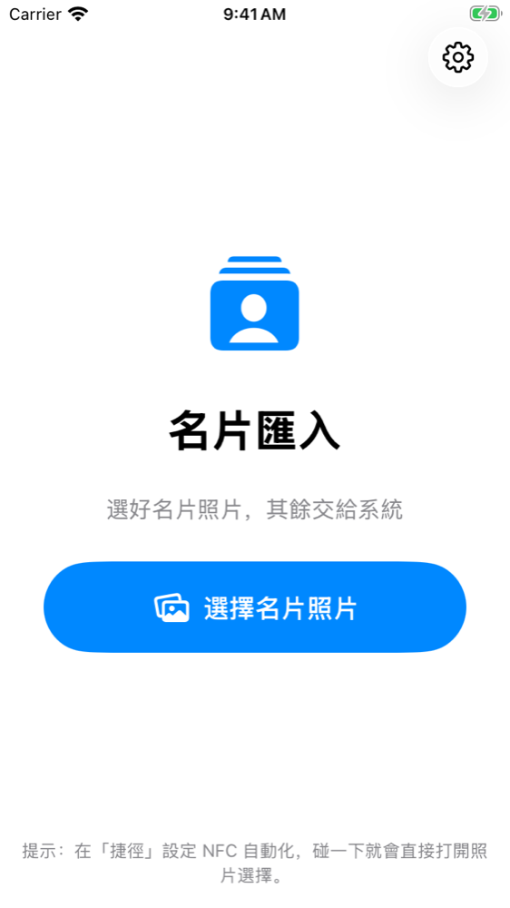
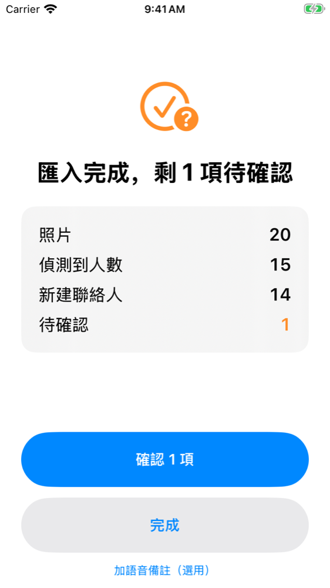

# CardImport：名片批次匯入 iPhone 聯絡人

目標：**選完名片照片之後，什麼都不用做，聯絡人就已經正確進入 iPhone。**

## 目前狀態

| 項目 | 狀態 |
|---|---|
| 辨識核心 | 完成；59 個單元測試（Linux 與 macOS CI）通過 |
| iOS App + 照片分享延伸 + NFC／捷徑入口 | 完成；Xcode 26.3 編譯通過、模擬器截圖見 `docs/screenshots/` |
| 準確度（模擬名片，AI 以代理方式執行） | 保留集：87% 聯絡人免人工即完全正確、人工介入 7%、錯配 0、去重 6/6 |
| 尚未驗證 | 真實名片、正式 API（時間與成本）、iPhone 實機 |

詳細數字與限制見 `docs/02-acceptance-report.md`。

| 首頁 | 完成畫面 | 只確認不確定的欄位 |
|---|---|---|
|  |  |  |

| 目錄 | 內容 |
|---|---|
| `docs/01-technical-analysis.md` | iOS 限制、操作流程、方案比較、架構決策、信心分數、配對、去重、批次架構 |
| `docs/02-acceptance-report.md` | 驗收測試結果（benchmark 數據）與尚未驗證的項目 |
| `Packages/CardCore/` | 辨識核心（Swift Package，iOS 與 Linux 都能編譯與測試） |
| `App/` | iOS App、照片分享延伸、NFC/捷徑入口。安裝方式見 `App/README.md` |
| `benchmark/` | 模擬名片資料集、跑分與評分程式 |
| `schema/` | AI 擷取的 JSON Schema |

## 開發者快速指令

```bash
# 核心單元測試（macOS 或 Linux）
cd Packages/CardCore && swift test

# Benchmark：免費方案（OCR + 規則）
cd benchmark
python3 make_inputs.py --out runs/heuristic-ts --scenario timestamps
../Packages/CardCore/.build/release/cardcore-cli run --photos runs/heuristic-ts/photos.json \
  --extractor heuristic --existing runs/heuristic-ts/existing_contacts.json --out runs/heuristic-ts/run.json
python3 score.py runs/heuristic-ts/run.json --expectations runs/heuristic-ts/expectations.json

# Benchmark：正式 AI 方案（需要 ANTHROPIC_API_KEY）
../Packages/CardCore/.build/release/cardcore-cli run --photos runs/claude-ts/photos.json --extractor claude --verify \
  --save-extractions runs/claude-ts/extractions --existing runs/claude-ts/existing_contacts.json --out runs/claude-ts/run.json
```

GitHub Actions（`.github/workflows/cardimport-ios.yml`）會在每次推送時於 macOS 上跑核心測試，並編譯 App 與分享延伸。
